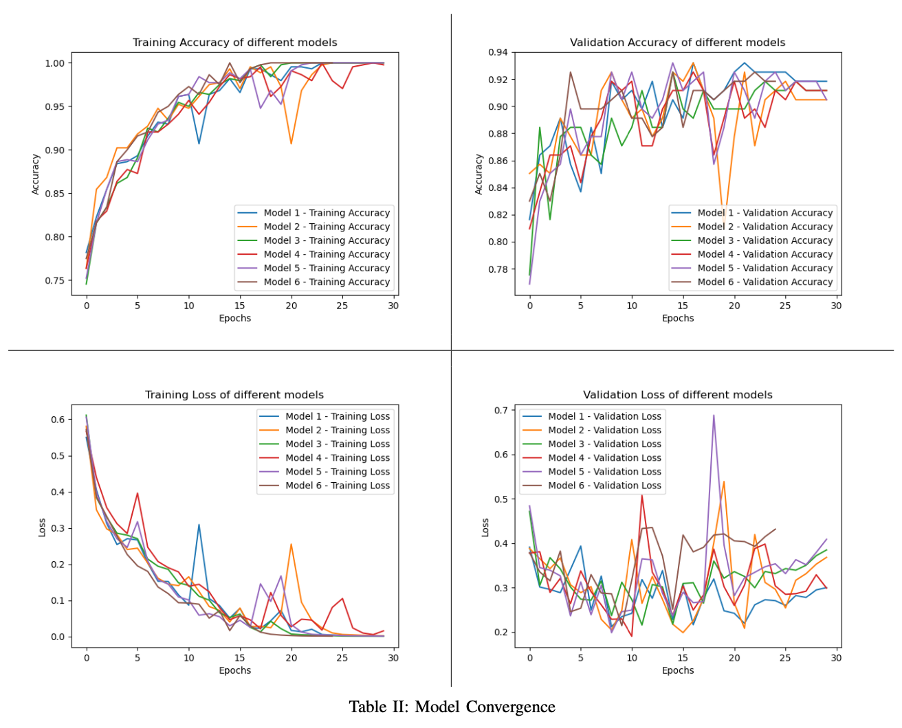

# Suspicious Activity Prediction based on Deep Learning

## Introduction
Around 3 million people worldwide have been victims of some crime daily. In January 2020, Surfshark published in its data report that the increased number of cameras does not correlate with the global crime index. This is because, after a point, it is not possible to have enough security personnel keeping track of a multitude of cameras 24 x 7 for the cameras actually to have an impact. This project proposes a deep learning-based approach for detecting suspicious activities live from CCTV footage. This project proposes an ensemble model based on Long-term Recurrent Convolutional Networks (LRCN) for the effective detection of suspicious activities and motionless objects in video data. The proposed ensemble model is trained on a large-scale dataset of labeled videos containing both normal and suspicious activities. 

## DataSet Description
We collected data from multiple datasets, namely the DCSASS dataset, Real Life Violence Situations Dataset, and UCF Crime Dataset. To create a comprehensive dataset for our specific project, we merged these datasets, resulting in over 800 videos that are categorized into predefined classes. These classes encompass a range of activities, including suspicious behaviors like fighting and vandalism, as well as non-suspicious activities such as walking and running. 
To detect objects like bags, handbags, and suitcases within the videos, we employed the 'YOLOv5' pre-trained model. This model has been widely recognized for its effectiveness in object detection tasks, making it a suitable choice for our project. By leveraging the capabilities of 'YOLOv5,' we aim to accurately identify and track these specific objects of interest within the video footage.

## DataSet Pre-Processing
We used the OpenCV library to read and extract frames from video files. The frames are extracted from all the videos in the selected classes in the dataset. Data augmentation methods were applied, including rotation, flipping, and brightness modifications. This improves the model's capacity to deal with realistic circumstances and learn invariant properties. After that, the retrieved frames are saved in a list. The data was then normalized by dividing each pixel value by 255, which is known as "255 normalizations" or "dividing by 255." to normalize pixel values to the range [0, 1] by dividing with the maximum value, i.e. 255. This ensures that the pixel values are represented as floating-point numbers between 0 and 1, which can be more convenient for specific operations or algorithms. Next, we set the height and width of each image frame to 64 and selected 30 frames per video as the sequence length. The list of classes used for training the model is specified in the classes variable. The extracted frames, class indexes, and video file paths are then utilized for training a deep-learning model, enabling it to classify videos into specified classes. 

The dataset was then split into train and test datasets using a 75:25 split ratio. This division allows for evaluating the performance of the trained model on unseen data and estimating its generalization capabilities.

Data pre-processing processes for motionless object recognition include determining the width and height of video frames and the frames per second (fps) value. These parameters provide crucial information about the video dimensions and timings. Additionally, the threshold and duration_threshold parameters are defined to determine the sensitivity of the motionless object detection algorithm.

## LRCN Model Creation
The LRCN model was constructed using Keras, a high-level neural networks API, and TensorFlow as a backend. The VGG16 model, pre-trained on the ImageNet dataset, was used as a feature extractor for individual frames. The fully connected layers of VGG16 were removed, and the remaining convolutional layers were used as a feature extractor for each frame in the video. The TimeDistributed layer was used to apply the VGG16 model to each frame in the video sequence.

There are two convolutional layers in the model architecture, each followed by a Rectified Linear Unit (ReLU) activation function and a Flatten layer. The TimeDistributed layer's output was sent into these layers, which retrieved more abstract information from individual frames. The flattened output was then fed into an LSTM layer, which captures the temporal relationships between the frames. Finally, for the multi-class categorization of the action in the movie, a Dense layer with a softmax activation function was utilized.

To increase the model's generalization performance, we trained several LRCN models. We employed early halting to avoid the model from over-fitting. We kept an eye on the validation set's accuracy, and if it didn't increase after ten epochs, we terminated training the model and utilized the weights with the highest validation accuracy.

To combine the predictions of the multiple LRCN models, we used the majority voting ensemble technique. For each test video, we made predictions using each of the six trained models and then selected the most common prediction as the final prediction. 

## Motionless Object Detection
The model first detects the specific objects defined in class_labels and draws bounding boxes around them using a pre-trained 'YOLOv5' model. The algorithm then tracks the position of the detected objects over time. By calculating the distance between consecutive object positions using the Euclidean distance method, the model determines if the object remains within a predefined threshold for a specific duration. If the object is motionless for a duration exceeding the duration_threshold, it is flagged as suspicious. On the other hand, if the object moves or a certain amount of time elapses, the algorithm resets the tracking and continues monitoring for other motionless objects. Annotated frames, denoting motionless suspiciously lying objects, are written to the output video. Overall, this model effectively identifies and highlights static objects which can pose threats, aiding in security and surveillance applications.

## Overall Flow of Model
The input video is initially processed by the LRCN model, which focuses on detecting suspicious activities. This model examines the video frames and annotates them with the corresponding activity class it identifies. Once the video has been processed by the LRCN model, the resulting output video is then passed through the Motionless Object Detection Algorithm.

The Motionless Object Detection Algorithm plays a crucial role in identifying stationary suspicious objects within the video. It carefully examines each frame and looks for objects that exhibit little to no movement over a significant duration. If such an object is detected, the algorithm draws a distinctive red bounding box around it to highlight its presence.

By combining the analysis from both the LRCN model and the Motionless Object Detection Algorithm, our system can effectively identify and annotate suspicious activities in the video footage, as well as detect stationary suspicious objects that may require further investigation.

## Model Output
We enhanced the visualization of our model's predictions by annotating the input video with informative elements. We drew green bounding boxes around the detected bags to highlight their presence and location within the frame. We further differentiated between bags in motion and stationary bags by dynamically adjusting the color of the bounding box. When a bag remained motionless for a duration exceeding a predefined threshold, the color of the bounding box transitioned to red, as shown in figure below, providing a clear indication of prolonged immobility.

Upon classifying the detected activity, we dynamically displayed the name of the corresponding suspicious activity class on the input video, as illustrated in the figure below.

 By incorporating these visual elements, our annotation technique enhances the clarity and comprehensibility of the model's predictions. The combination of annotated bounding boxes and dynamic text annotations facilitates a more intuitive interpretation of the model's detection and classification capabilities, enabling users to identify and analyze suspicious activities in surveillance videos quickly.

## Analysis of Ensemble Performance

The graphs shown in the figure below depict the convergence behavior of multiple models during the training process. The first two graphs illustrate each model's training and validation accuracy curves, representing the models' accuracy values throughout the training process. The increasing accuracy trend suggests that the models are improving their predictive performance. In both graphs, the convergence of the curves indicates that the models have reached a stable state, where further training may not yield significant improvements. The last two graphs show the training and validation loss curves, indicating each model's change in loss values over epochs. The decreasing trend in the loss signifies that the models are improving their performance and learning from the training data. 

The box plots in the figure depict the distribution of training and validation loss and training and validation accuracy for the ensemble models. The first two graphs show the training and validation accuracy box plots showcasing the distribution of accuracy values across the ensemble models. The y-axis represents the accuracy values, while the x-axis represents the models. Similarly, the last two graphs show the training and validation loss box plots illustrating the spread of loss values across the ensemble models. The y-axis represents the loss values, while the x-axis indicates the models. By analyzing these box plots, we can gain insights into the spread and stability of loss and accuracy values within the ensemble. They contribute to understanding the ensemble models' convergence behavior and performance characteristics.

## Conclusion
We have demonstrated the successful prediction of classes of activities (suspicious and non-suspicious) and suspicious objects using the Majority Voting-LRCN model, which gives a much better performance than the regular LRCN model and using the Yolo V5 object detection model. 

The accurate classification of activities presented in this research holds great potential for various real-time surveillance applications. By leveraging the capabilities of the Majority Voting-LRCN model, it becomes feasible to develop an advanced surveillance system that can actively monitor CCTV data in real time. Such a system has the potential to enhance public safety, prevent potential casualties, and facilitate the identification of individuals involved in suspicious activities.

Integrating this predictive model into existing surveillance systems can significantly augment their effectiveness. The system can swiftly identify and flag potential threats or suspicious behaviors by continuously analyzing video footage, allowing security personnel to respond promptly and effectively. This proactive approach can mitigate security risks and enhance the overall security infrastructure.

It is important to note that further research and development are required to refine and optimize the proposed model. Future endeavors should focus on expanding the range of detectable activities and objects, improving the accuracy of predictions, and addressing limitations such as real-time data capturing and variability in ensemble algorithm runs. Additionally, incorporating higher-resolution surveillance networks can enhance the system's performance, especially in real-time recordings characterized by noise and low-quality footage.
